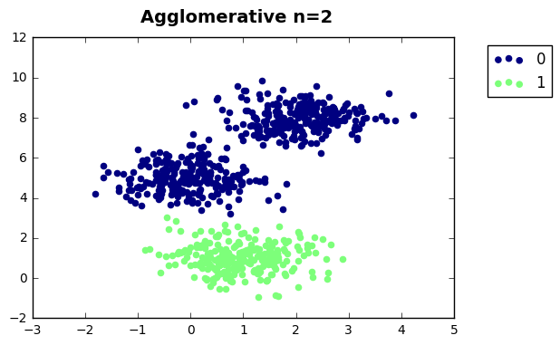
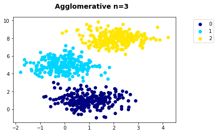
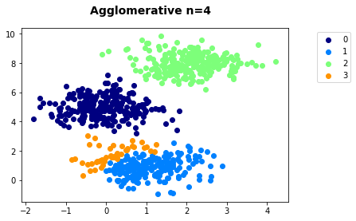
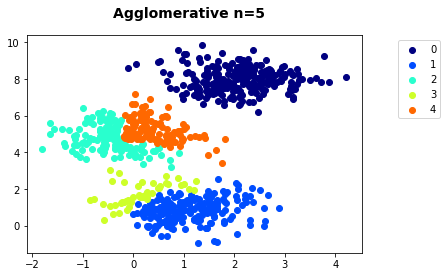
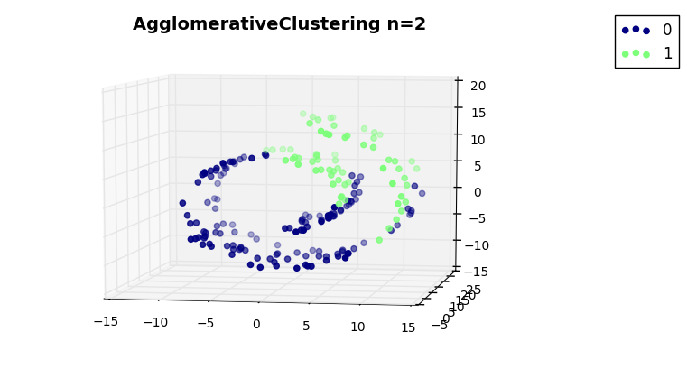
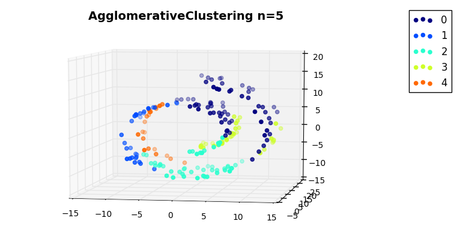

>**Note**: This is a generated output from the Jupyter notebook file [clustering_agglomerative.ipynb](clustering_agglomerative.ipynb).

# Agglomerative Clustering (Hierarchical Clustering) 


```python
%matplotlib inline
import matplotlib.pyplot as plt
import mpl_toolkits.mplot3d.axes3d as p3

import pandas as pd
import numpy as np

from sklearn import datasets
from sklearn import cluster
from sklearn import manifold
```


```python
data, labels_true = datasets.make_blobs(n_samples=750, centers=[[1,1],[0,5],[2,8]], cluster_std=0.7,
                            random_state=0)


plt.scatter(data[:,0], data[:,1])

df = pd.DataFrame(data, columns=['X', 'Y'])
```


    

    


```python
hclust = cluster.AgglomerativeClustering(n_clusters=2)
label = hclust.fit_predict(df)
df['label'] = label


fig = plt.figure()
fig.suptitle('Agglomerative n=2', fontsize=14, fontweight='bold')
ax = fig.add_subplot(111)

clusters = list(set(label))

for i in range(len(clusters)):
    plt.scatter(df[df.label == clusters[i]].X, df[df.label == clusters[i]].Y, 
                label=i, color=plt.cm.jet(np.float(i) / len(np.unique(label))))


plt.legend(bbox_to_anchor=(1.25, 1))
```


    <matplotlib.legend.Legend at 0x10b8a50f0>


    

    


Clustering with 3 clusters


```python
hclust = cluster.AgglomerativeClustering(n_clusters=3)
label = hclust.fit_predict(df)
df['label'] = label

fig = plt.figure()
fig.suptitle('Agglomerative n=3', fontsize=14, fontweight='bold')
ax = fig.add_subplot(111)

clusters = list(set(label))

for i in range(len(clusters)):
    plt.scatter(df[df.label == clusters[i]].X, df[df.label == clusters[i]].Y, 
                label=i, color=plt.cm.jet(np.float(i) / len(np.unique(label))))

plt.legend(bbox_to_anchor=(1.25, 1))
```


    <matplotlib.legend.Legend at 0x10b08f7f0>


    

    


Clustering with 4 clusters


```python
hclust = cluster.AgglomerativeClustering(n_clusters=4)
label = hclust.fit_predict(df)
df['label'] = label

fig = plt.figure()
fig.suptitle('Agglomerative n=4', fontsize=14, fontweight='bold')
ax = fig.add_subplot(111)

clusters = list(set(label))

for i in range(len(clusters)):
    plt.scatter(df[df.label == clusters[i]].X, df[df.label == clusters[i]].Y, 
                label=i, color=plt.cm.jet(np.float(i) / len(np.unique(label))))

plt.legend(bbox_to_anchor=(1.25, 1))
```


    <matplotlib.legend.Legend at 0x10ba26e48>


    

    


```python
hclust = cluster.AgglomerativeClustering(n_clusters=5)
label = hclust.fit_predict(df)
df['label'] = label

fig = plt.figure()
fig.suptitle('Agglomerative n=5', fontsize=14, fontweight='bold')
ax = fig.add_subplot(111)

clusters = list(set(label))

for i in range(len(clusters)):
    plt.scatter(df[df.label == clusters[i]].X, df[df.label == clusters[i]].Y, 
                label=i, color=plt.cm.jet(np.float(i) / len(np.unique(label))))

plt.legend(bbox_to_anchor=(1.25, 1))
```


    <matplotlib.legend.Legend at 0x10bb85f98>


    

    


```python
data, t = datasets.make_swiss_roll(n_samples=200, noise=0.1, random_state=0)

df = pd.DataFrame(data, columns=['X', 'Y', 'Z'])


fig = plt.figure()
ax = p3.Axes3D(fig)
ax.view_init(7, -80)

ax.scatter(df.X, df.Y, df.Z, 'o')
```


    <mpl_toolkits.mplot3d.art3d.Path3DCollection at 0x10beef5f8>


    

    


```python
hclust = cluster.AgglomerativeClustering(n_clusters=2)
label = hclust.fit_predict(data)
df['label'] = label

fig = plt.figure()
ax = p3.Axes3D(fig)
ax.view_init(7, -80)

fig.suptitle('AgglomerativeClustering n=2', fontsize=14, fontweight='bold')

for i, l in enumerate(np.unique(label)):
    ax.scatter(df[df.label == l].X, df[df.label == l].Y, df[df.label == l].Z, 'o', 
               color=plt.cm.jet(np.float(i) / len(np.unique(label))), label=l)
    
plt.legend(bbox_to_anchor=(1.25, 1))
```


    <matplotlib.legend.Legend at 0x10d0226d8>


    

    


```python
hclust = cluster.AgglomerativeClustering(n_clusters=5)
label = hclust.fit_predict(data)
df['label'] = label

fig = plt.figure()
ax = p3.Axes3D(fig)
ax.view_init(7, -80)

fig.suptitle('AgglomerativeClustering n=5', fontsize=14, fontweight='bold')

for i, l in enumerate(np.unique(label)):
    ax.scatter(df[df.label == l].X, df[df.label == l].Y, df[df.label == l].Z, 'o', 
               color=plt.cm.jet(np.float(i) / len(np.unique(label))), label=l)
    
plt.legend(bbox_to_anchor=(1.25, 1))
```


    <matplotlib.legend.Legend at 0x10de21a58>


    

    


```python

```
