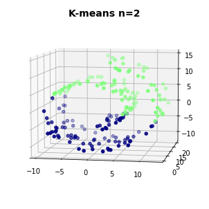

>**Note**: This is a generated markdown export from the Jupyter notebook file [clustering_kmeans.ipynb](clustering_kmeans.ipynb).
>You can also view the notebook with the [nbviewer](https://nbviewer.jupyter.org/github/rueedlinger/machine-learning-snippets/blob/master/notebooks/unsupervised/clustering/kmeans/clustering_kmeans.ipynb) from Jupyter. 

# Clustering with K-means 


```python
%matplotlib inline
import matplotlib.pyplot as plt
import mpl_toolkits.mplot3d.axes3d as p3

import pandas as pd
import numpy as np

from sklearn import datasets
from sklearn import cluster
```


```python
data, labels_true = datasets.make_blobs(n_samples=750, centers=[[1,1],[0,5],[2,8]], cluster_std=0.7,
                            random_state=0)


plt.scatter(data[:,0], data[:,1])

df = pd.DataFrame(data, columns=['X', 'Y'])

```


    

    


```python
kmeans = cluster.KMeans(n_clusters=2)
label = kmeans.fit_predict(data)
df['label'] = label


fig = plt.figure()
fig.suptitle('K-means n=2', fontsize=14, fontweight='bold')
ax = fig.add_subplot(111)


for i in range(kmeans.n_clusters):
    plt.scatter(df[df.label == i].X, df[df.label == i].Y, label=i, color=plt.cm.jet(float(i) / len(np.unique(label))))

for i in kmeans.cluster_centers_:
    plt.scatter(i[0], i[1], color='black', marker='+', s=100)
    
_ = plt.legend(bbox_to_anchor=(1.25, 1))
```


    

    


Clustering with 3 clusters


```python
kmeans = cluster.KMeans(n_clusters=3)
label = kmeans.fit_predict(data)
df['label'] = label

fig = plt.figure()
fig.suptitle('K-means n=3', fontsize=14, fontweight='bold')
ax = fig.add_subplot(111)

for i in range(kmeans.n_clusters):
    plt.scatter(df[df.label == i].X, df[df.label == i].Y, label=i, color=plt.cm.jet(float(i) / len(np.unique(label))))

for i in kmeans.cluster_centers_:
    plt.scatter(i[0], i[1], color='black', marker='+', s=100)
    
_ = plt.legend(bbox_to_anchor=(1.25, 1))
```


    

    


Clustering with 4 clusters


```python
kmeans = cluster.KMeans(n_clusters=4)
label = kmeans.fit_predict(data)
df['label'] = label


fig = plt.figure()
fig.suptitle('K-means n=4', fontsize=14, fontweight='bold')
ax = fig.add_subplot(111)


for i in range(kmeans.n_clusters):
    plt.scatter(df[df.label == i].X, df[df.label == i].Y, label=i, color=plt.cm.jet(float(i) / len(np.unique(label))))
    
for i in kmeans.cluster_centers_:
    plt.scatter(i[0], i[1], color='black', marker='+', s=100)

_ = plt.legend(bbox_to_anchor=(1.25, 1))
```


    

    


```python
kmeans = cluster.KMeans(n_clusters=5)
label = kmeans.fit_predict(data)
df['label'] = label


fig = plt.figure()
fig.suptitle('K-means n=5', fontsize=14, fontweight='bold')
ax = fig.add_subplot(111)


for i in range(kmeans.n_clusters):
    plt.scatter(df[df.label == i].X, df[df.label == i].Y, label=i, color=plt.cm.jet(float(i) / len(np.unique(label))))
    
for i in kmeans.cluster_centers_:
    plt.scatter(i[0], i[1], color='black', marker='+', s=100)

_ = plt.legend(bbox_to_anchor=(1.25, 1))
```


    

    


```python
data, t = datasets.make_swiss_roll(n_samples=200, noise=0.1, random_state=0)
df = pd.DataFrame(data, columns=['X', 'Y', 'Z'])

fig = plt.figure()
ax = p3.Axes3D(fig)
ax.view_init(7, -80)

_ = ax.scatter(df.X, df.Y, df.Z, 'o')
```


    

    


```python

kmeans = cluster.KMeans(n_clusters=2)
label = kmeans.fit_predict(data, )

df['label'] = label

fig = plt.figure()
ax = p3.Axes3D(fig)
ax.view_init(7, -80)
fig.suptitle('K-means n=2', fontsize=14, fontweight='bold')

for l in np.unique(label):
    
    ax.scatter(df[df.label == l].X, df[df.label == l].Y, df[df.label == l].Z, 
               'o', color=plt.cm.jet(float(l) / len(np.unique(label))))

```


    

    


```python

kmeans = cluster.KMeans(n_clusters=3)
label = kmeans.fit_predict(data, )

df['label'] = label

fig = plt.figure()
ax = p3.Axes3D(fig)
ax.view_init(7, -80)
fig.suptitle('K-means n=3', fontsize=14, fontweight='bold')

for l in np.unique(label):
    
    ax.scatter(df[df.label == l].X, df[df.label == l].Y, df[df.label == l].Z, 
               'o', color=plt.cm.jet(float(l) / len(np.unique(label))))

```


    

    


```python

kmeans = cluster.KMeans(n_clusters=4)
label = kmeans.fit_predict(data, )

df['label'] = label

fig = plt.figure()
ax = p3.Axes3D(fig)
ax.view_init(7, -80)
fig.suptitle('K-means n=4', fontsize=14, fontweight='bold')

for l in np.unique(label):
    
    ax.scatter(df[df.label == l].X, df[df.label == l].Y, df[df.label == l].Z, 
               'o', color=plt.cm.jet(float(l) / len(np.unique(label))))

```


    

    


```python

kmeans = cluster.KMeans(n_clusters=5)
label = kmeans.fit_predict(data, )

df['label'] = label

fig = plt.figure()
ax = p3.Axes3D(fig)
ax.view_init(7, -80)
fig.suptitle('K-means n=5', fontsize=14, fontweight='bold')

for l in np.unique(label):
    
    ax.scatter(df[df.label == l].X, df[df.label == l].Y, df[df.label == l].Z, 
               'o', color=plt.cm.jet(float(l) / len(np.unique(label))))

```


    

    
