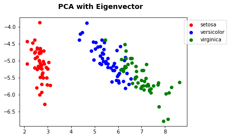

>**Note**: This is a generated output from the Jupyter notebook file [dimensionality_reduction_eigen.ipynb](dimensionality_reduction_eigen.ipynb).

# Dimensionality Reduction with Eigenvector / Eigenvalues and Correlation Matrix (PCA)

inspired by http://sebastianraschka.com/Articles/2015_pca_in_3_steps.html#eigendecomposition---computing-eigenvectors-and-eigenvalues


```python
%matplotlib inline
import matplotlib.pyplot as plt
import seaborn as sns
import pandas as pd
import numpy as np
from numpy import linalg as LA

from sklearn import datasets
```


```python
iris = datasets.load_iris()
```

First we need the correlation matrix


```python
df = pd.DataFrame(iris.data, columns=iris.feature_names)
corr = df.corr()
df.corr()
```


<div>
<table border="1" class="dataframe">
  <thead>
    <tr style="text-align: right;">
      <th></th>
      <th>sepal length (cm)</th>
      <th>sepal width (cm)</th>
      <th>petal length (cm)</th>
      <th>petal width (cm)</th>
    </tr>
  </thead>
  <tbody>
    <tr>
      <th>sepal length (cm)</th>
      <td>1.000000</td>
      <td>-0.109369</td>
      <td>0.871754</td>
      <td>0.817954</td>
    </tr>
    <tr>
      <th>sepal width (cm)</th>
      <td>-0.109369</td>
      <td>1.000000</td>
      <td>-0.420516</td>
      <td>-0.356544</td>
    </tr>
    <tr>
      <th>petal length (cm)</th>
      <td>0.871754</td>
      <td>-0.420516</td>
      <td>1.000000</td>
      <td>0.962757</td>
    </tr>
    <tr>
      <th>petal width (cm)</th>
      <td>0.817954</td>
      <td>-0.356544</td>
      <td>0.962757</td>
      <td>1.000000</td>
    </tr>
  </tbody>
</table>
</div>


```python
sns.heatmap(corr)
```


    <matplotlib.axes._subplots.AxesSubplot at 0x10a8c8f28>


    

    


```python
eig_vals, eig_vecs = LA.eig(corr)
eig_pairs = [(np.abs(eig_vals[i]), eig_vecs[:,i]) for i in range(len(eig_vals))]

eig_pairs.sort(key=lambda x: x[0], reverse=True)

```

Eigenvalues


```python
pd.DataFrame([eig_vals])
```


<div>
<table border="1" class="dataframe">
  <thead>
    <tr style="text-align: right;">
      <th></th>
      <th>0</th>
      <th>1</th>
      <th>2</th>
      <th>3</th>
    </tr>
  </thead>
  <tbody>
    <tr>
      <th>0</th>
      <td>2.910818</td>
      <td>0.921221</td>
      <td>0.147353</td>
      <td>0.020608</td>
    </tr>
  </tbody>
</table>
</div>


Eigenvector as Principal component


```python
pd.DataFrame(eig_vecs)
```


<div>
<table border="1" class="dataframe">
  <thead>
    <tr style="text-align: right;">
      <th></th>
      <th>0</th>
      <th>1</th>
      <th>2</th>
      <th>3</th>
    </tr>
  </thead>
  <tbody>
    <tr>
      <th>0</th>
      <td>0.522372</td>
      <td>-0.372318</td>
      <td>-0.721017</td>
      <td>0.261996</td>
    </tr>
    <tr>
      <th>1</th>
      <td>-0.263355</td>
      <td>-0.925556</td>
      <td>0.242033</td>
      <td>-0.124135</td>
    </tr>
    <tr>
      <th>2</th>
      <td>0.581254</td>
      <td>-0.021095</td>
      <td>0.140892</td>
      <td>-0.801154</td>
    </tr>
    <tr>
      <th>3</th>
      <td>0.565611</td>
      <td>-0.065416</td>
      <td>0.633801</td>
      <td>0.523546</td>
    </tr>
  </tbody>
</table>
</div>


Create the projection matrix for a new two dimensional space


```python
matrix_w = np.hstack((eig_pairs[0][1].reshape(len(corr),1),
                      eig_pairs[1][1].reshape(len(corr),1)))


pd.DataFrame(matrix_w, columns=['PC1', 'PC2'])
```


<div>
<table border="1" class="dataframe">
  <thead>
    <tr style="text-align: right;">
      <th></th>
      <th>PC1</th>
      <th>PC2</th>
    </tr>
  </thead>
  <tbody>
    <tr>
      <th>0</th>
      <td>0.522372</td>
      <td>-0.372318</td>
    </tr>
    <tr>
      <th>1</th>
      <td>-0.263355</td>
      <td>-0.925556</td>
    </tr>
    <tr>
      <th>2</th>
      <td>0.581254</td>
      <td>-0.021095</td>
    </tr>
    <tr>
      <th>3</th>
      <td>0.565611</td>
      <td>-0.065416</td>
    </tr>
  </tbody>
</table>
</div>


```python
new_dim = np.dot(np.array(iris.data), matrix_w)

df = pd.DataFrame(new_dim, columns=['X', 'Y'])
df['label'] = iris.target
df.head()

```


<div>
<table border="1" class="dataframe">
  <thead>
    <tr style="text-align: right;">
      <th></th>
      <th>X</th>
      <th>Y</th>
      <th>label</th>
    </tr>
  </thead>
  <tbody>
    <tr>
      <th>0</th>
      <td>2.669231</td>
      <td>-5.180887</td>
      <td>0</td>
    </tr>
    <tr>
      <th>1</th>
      <td>2.696434</td>
      <td>-4.643645</td>
      <td>0</td>
    </tr>
    <tr>
      <th>2</th>
      <td>2.481163</td>
      <td>-4.752183</td>
      <td>0</td>
    </tr>
    <tr>
      <th>3</th>
      <td>2.571512</td>
      <td>-4.626615</td>
      <td>0</td>
    </tr>
    <tr>
      <th>4</th>
      <td>2.590658</td>
      <td>-5.236211</td>
      <td>0</td>
    </tr>
  </tbody>
</table>
</div>


```python
fig = plt.figure()
fig.suptitle('PCA with Eigenvector', fontsize=14, fontweight='bold')
ax = fig.add_subplot(111)

plt.scatter(df[df.label == 0].X, df[df.label == 0].Y, color='red', label=iris.target_names[0])
plt.scatter(df[df.label == 1].X, df[df.label == 1].Y, color='blue', label=iris.target_names[1])
plt.scatter(df[df.label == 2].X, df[df.label == 2].Y, color='green', label=iris.target_names[2])

plt.legend(bbox_to_anchor=(1.25, 1))

```


    <matplotlib.legend.Legend at 0x10ab8bbe0>


    

    
