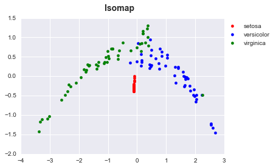

>**Note**: This is a generated markdown export from the Jupyter notebook file [dimensionality_reduction_isomap.ipynb](dimensionality_reduction_isomap.ipynb).

# Dimensionality Reduction with Isomap


```python
%matplotlib inline
import matplotlib.pyplot as plt
import seaborn as sns
import pandas as pd

from sklearn import manifold, datasets
from matplotlib.colors import ListedColormap

```


```python
iris = datasets.load_iris()
isomap = manifold.Isomap(n_components=2)
new_dim = isomap.fit_transform(iris.data)
```


```python
df = pd.DataFrame(new_dim, columns=['X', 'Y'])
df['label'] = iris.target
df.head()
```


<div>
<style scoped>
    .dataframe tbody tr th:only-of-type {
        vertical-align: middle;
    }

    .dataframe tbody tr th {
        vertical-align: top;
    }

    .dataframe thead th {
        text-align: right;
    }
</style>
<table border="1" class="dataframe">
  <thead>
    <tr style="text-align: right;">
      <th></th>
      <th>X</th>
      <th>Y</th>
      <th>label</th>
    </tr>
  </thead>
  <tbody>
    <tr>
      <th>0</th>
      <td>0.118155</td>
      <td>0.381038</td>
      <td>0</td>
    </tr>
    <tr>
      <th>1</th>
      <td>0.113729</td>
      <td>0.323243</td>
      <td>0</td>
    </tr>
    <tr>
      <th>2</th>
      <td>0.113922</td>
      <td>0.325955</td>
      <td>0</td>
    </tr>
    <tr>
      <th>3</th>
      <td>0.113904</td>
      <td>0.325207</td>
      <td>0</td>
    </tr>
    <tr>
      <th>4</th>
      <td>0.117613</td>
      <td>0.372992</td>
      <td>0</td>
    </tr>
  </tbody>
</table>
</div>


```python
fig = plt.figure()
fig.suptitle('Isomap', fontsize=14, fontweight='bold')
ax = fig.add_subplot(111)

plt.scatter(df[df.label == 0].X, df[df.label == 0].Y, color='red', label=iris.target_names[0])
plt.scatter(df[df.label == 1].X, df[df.label == 1].Y, color='blue', label=iris.target_names[1])
plt.scatter(df[df.label == 2].X, df[df.label == 2].Y, color='green', label=iris.target_names[2])

plt.legend(bbox_to_anchor=(1.25, 1))
```


    <matplotlib.legend.Legend at 0x132900670>


    

    
