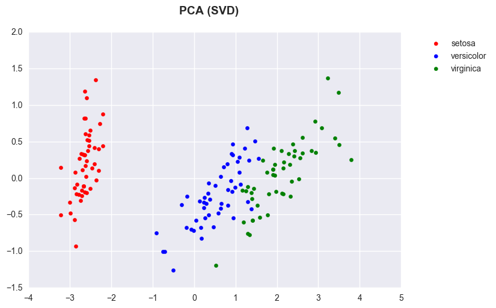

>**Note**: This is a generated markdown export from the Jupyter notebook file [dimensionality_reduction_pca.ipynb](dimensionality_reduction_pca.ipynb).

# Dimensionality Reduction with PCA (SVD)


```python
%matplotlib inline
import matplotlib.pyplot as plt
import seaborn as sns
import pandas as pd

from sklearn import decomposition, datasets
from matplotlib.colors import ListedColormap


```


```python
iris = datasets.load_iris()
pca = decomposition.PCA(n_components=2)
new_dim = pca.fit_transform(iris.data)
```


```python
df = pd.DataFrame(new_dim, columns=['X', 'Y'])
df['label'] = iris.target
df.head()
```


<div>
<table border="1" class="dataframe">
  <thead>
    <tr style="text-align: right;">
      <th></th>
      <th>X</th>
      <th>Y</th>
      <th>label</th>
    </tr>
  </thead>
  <tbody>
    <tr>
      <th>0</th>
      <td>-2.684126</td>
      <td>0.319397</td>
      <td>0</td>
    </tr>
    <tr>
      <th>1</th>
      <td>-2.714142</td>
      <td>-0.177001</td>
      <td>0</td>
    </tr>
    <tr>
      <th>2</th>
      <td>-2.888991</td>
      <td>-0.144949</td>
      <td>0</td>
    </tr>
    <tr>
      <th>3</th>
      <td>-2.745343</td>
      <td>-0.318299</td>
      <td>0</td>
    </tr>
    <tr>
      <th>4</th>
      <td>-2.728717</td>
      <td>0.326755</td>
      <td>0</td>
    </tr>
  </tbody>
</table>
</div>


```python

fig = plt.figure()
fig.suptitle('PCA (SVD)', fontsize=14, fontweight='bold')
ax = fig.add_subplot(111)

plt.scatter(df[df.label == 0].X, df[df.label == 0].Y, color='red', label=iris.target_names[0])
plt.scatter(df[df.label == 1].X, df[df.label == 1].Y, color='blue', label=iris.target_names[1])
plt.scatter(df[df.label == 2].X, df[df.label == 2].Y, color='green', label=iris.target_names[2])

plt.legend(bbox_to_anchor=(1.25, 1))
```


    <matplotlib.legend.Legend at 0x123bb2c40>


    

    
